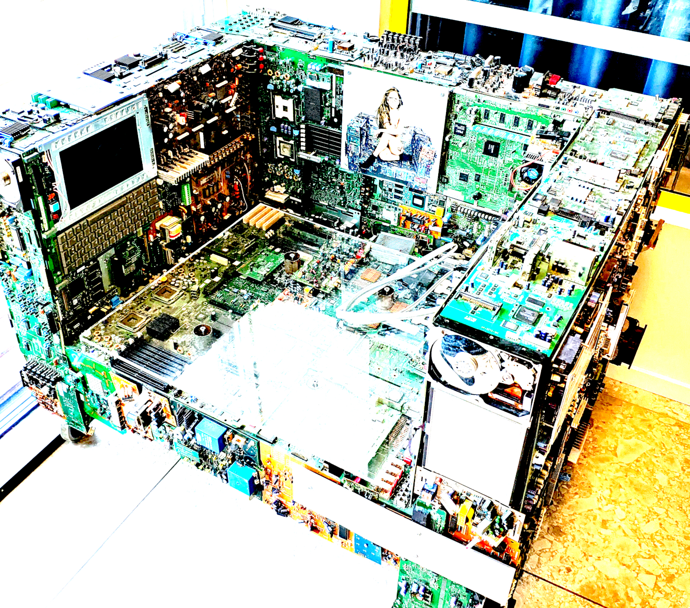

# ktchn8s

_...there's no place like_ `~`

<b>🚧 Fork in progress, expect some dust 🚧</b>

> `/ˈkɪtʃ.ən.eɪts/` (“Kitch-en-ates”)

A homelab ☸️ kubernetes cluster 👾
 ...right in your kitchen 🚀💥

**[:material-star-circle-outline: Features](#features) ⟩ [:material-rocket-launch: Getting Started](#getting-started) ⟩ [:material-file-document-multiple: Documentation](https://serpro69.github.io/ktchn8s/latest)**

---

## About

This project utilizes [Infrastructure as Code](https://en.wikipedia.org/wiki/Infrastructure_as_code) and [GitOps](https://www.weave.works/technologies/gitops) to automate provisioning, operating, and updating self-hosted services in my homelab.
It can also be used as a framework to build your own homelab.

If you encounter an issue or want to contribute a fix or an improvement, please create [a bug issue](https://github.com/serpro69/ktchn8s/issues/new?template=bug.md).
 If you have a question or want to chat about this project, please create [a new discussion](https://github.com/serpro69/ktchn8s/discussions/new/choose).

## Overview

This project is still in the experimental stage. This means, among other things, that:

- There might be breaking changes that may require a complete redeployment.
- A proper upgrade path is planned for the stable release.

More information can be found in the [roadmap](https://serpro69.github.io/ktchn8s/latest/info/roadmap/).

### Hardware

- Network:
    - Cisco C1111-8P Router
    - Cisco C3560-GS-8P Switch
    - Eero 6 Router (used as access-point for WiFi at home)
- Servers:
    - 1 x NAS
        - [Fractal Design Node 804](https://www.fractal-design.com/products/cases/node/node-804/black/) case
        - CWWK/Topton J6413 motherboard
        - CPU: `Intel Celeron J6413`
        - RAM: 2x `16GB DDR4`
        - SSD: 2x `512GB WD RED NVME` in a zfs mirror (OS)
        - HDD: 6x `18TB Seagate Exos` (Storage)
    - 1 × Lenovo Tiny M70q Gen.3
        - CPU: `Intel Core i5-12400T`
        - RAM: 2x `16GB DDR4`
        - SSD: `256GB NVME`
    - 2 × Lenovo Tiny M70q Gen.3
        - CPU: `Intel Core i5-12400T`
        - RAM: `16GB DDR4`
        - SSD: `256GB NVME`
    - 2 × Lenovo Tiny M70q Gen.2
        - CPU: `Intel Core i5-11400T`
        - RAM: `16GB DDR4`
        - SSD: `256GB NVME`
    - 7 × Lenovo Tiny M720q
        - CPU: `Intel Core i5-8100T`
        - RAM: `16GB`
        - SSD: `512GB NVME`
    - 1 x HP EliteDesk 800 G3 Mini
        - CPU: `Intel Core i5-7500 vPro`
        - RAM: `16GB`
        - SSD: `256GB SATA`

### Features

- [x] Common applications: Gitea, Jellyfin, Paperless...
- [x] Automated bare metal provisioning with PXE boot
- [x] Automated Kubernetes installation and management
- [x] Installing and managing applications using GitOps
- [x] Automatic rolling upgrade for OS and Kubernetes
- [ ] Automatically update apps (with approval)
- [x] Modular architecture, easy to add or remove features/components
- [x] Automated certificate management
- [x] Automatically update DNS records for exposed services
- [ ] VPN (Tailscale or Wireguard)
- [x] Expose services to the internet securely with [Cloudflare Tunnel](https://www.cloudflare.com/products/tunnel/)
- [x] CI/CD platform
- [x] Private container registry
- [ ] Distributed storage
- [ ] Support multiple environments (dev, prod)
- [ ] Monitoring and alerting
- [ ] Automated backup and restore
- [x] Single sign-on
- [x] Infrastructure testing

Some demo videos and screenshots are shown here.
They can't capture all the project's features, but they are sufficient to get a concept of it.

| Demo Showcase                                                           |
| :--:                                                                    |
| Homepage powered by... [Homepage](https://gethomepage.dev)              |
| [![][homepage-demo]][homepage-demo]                                     |
| Git server powered by [Gitea](https://gitea.io/en-us)                   |
| [![][gitea-demo]][gitea-demo]                                           |
| Continuous Integration with [Woodpecker CI](https://woodpecker-ci.org/) |
| [![][woodpecker-demo]][woodpecker-demo]                                 |
| Continuous Deployment with [ArgoCD](https://argoproj.github.io/cd)      |
| [![][argocd-demo]][argocd-demo]                                         |
| Identity Management with [Kanidm](https://kanidm.com/)                  |
| [![][kanidm-demo]][kanidm-demo]                                         |
| Monitoring with [Grafana](https://grafana.com/)                         |
| [![][grafana-demo]][grafana-demo]                                       |

[homepage-demo]: assets/images/readme/468365600-153d4317-7848-4712-b27f-c89fa30e9dbf.png
[gitea-demo]: assets/images/readme/460288220-f3775815-6c55-4086-b15a-8e0562e5d6a6.png
[woodpecker-demo]: assets/images/readme/463804608-70b7e19f-22a3-4d95-aad1-da389d90c53e.png
[argocd-demo]: assets/images/readme/460288182-bdd91804-2e10-4910-8cf6-afa15e433178.png
[kanidm-demo]: assets/images/readme/468351420-81c1da79-31ab-4120-b9e8-dc52c94b0fde.png
[grafana-demo]: assets/images/readme/468351854-a4a53ec5-cb0d-4513-be81-fd646ae66d55.png

## Getting Started

[Deploy on real hardware](https://serpro69.github.io/ktchn8s/latest/installation/production) for production workload.

...or simply:

<pre style="margin-left: 25%; margin-right: auto;">
<code style="background-color: #070707;">
           ╭──────────────────────────────────────────────────╮
           │                        🐧                        │
           │    ╭────────────────────────────────────────╮    │
           │    │$ nix develop                           │    │
           │    │$ make ktchn8s                          │    │
           │    │...                                     │    │
           │    │                                        │    │
           │    │                                        │    │
           │    │                                        │    │
           │    │                                        │    │
           │    │ 🚀                                     │    │
           │    │                                        │    │
           │    │                                        │    │
           │    ╰────────────────────────────────────────╯    │
           │                                                  │
           ╰──────────────────────────────────────────────────╯
                   ╰──────────────────────────────────╯
               ╭───|──────────────────────────────────|───╮
             _-'    .-.-.-.-.-.-.-.-.-.-.-.-.-.-.-.-.  --- `-_
          _-'.-.-. .---.-.-.-.-.-.-.-.-.-.-.-.-.-.-.--.  .-.-.`-_
       _-'.-.-.-. .---.-.-.-.-.-.-.-.-.-.-.-.-.-.-.-`__`. .-.-.-.`-_
    _-'.-.-.-.-. .-----.-.-.-.-.-.-.-.-.-.-.-.-.-.-.-----. .-.-.-.-.`-_
 _-'.-.-.-.-.-. .---.-. .-------------------------. .-.---. .---.-.-.-.`-_
╭─────────────────────────────────────────────────────────────────────────╮
╰───._.─────────────────────────────────────────────────────────────._.───╯
</code></pre>

## Roadmap

See [roadmap](https://serpro69.github.io/ktchn8s/latest/info/roadmap/) and [open issues](https://github.com/serpro69/ktchn8s/issues) for a list of proposed features and known issues.

## Contributing

Any contributions you make are greatly appreciated.

Please see [contributing guide](https://serpro69.github.io/ktchn8s/latest/info/contributing/) for more information.

## License

Copyright &copy; 2025 - present, [serpro69](https://github.com/serpro69)

Distributed under the MIT License.
See [license page](https://serpro69.github.io/ktchn8s/latest/info/license) or [`LICENSE.md`](https://github.com/serpro69/ktchn8s/blob/master/LICENSE.md) file for more information.
