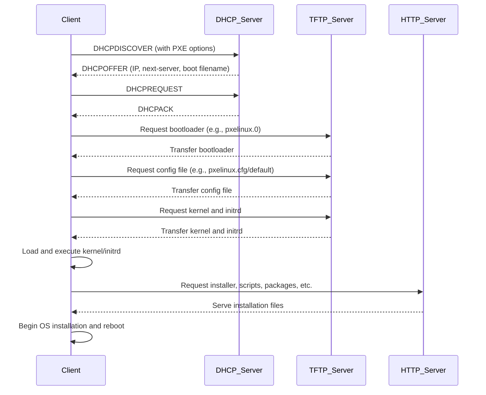

# PXE boot

## What is PXE Boot?

PXE (Preboot Execution Environment) boot lets a computer start up and load an operating system **over a network**, instead of from its hard drive or USB.

Think of it like this:

Imagine a computer with no software installed. When you turn it on, it uses PXE to say:

> "Hey, is there a server on the network that can help me start up?"

If there is a server ready to help, it responds and says:

> "Yes! Here’s a small program you can run to get started."

That small program helps the computer download more software (like a full operating system) to finish booting.

## Key Services in PXE Boot Process

### DHCP (Dynamic Host Configuration Protocol) Server

Purpose: Gives the computer an IP address so it can communicate on the network.

PXE Role: Also tells the computer where to find the boot server (often via a special option like next-server or option 66/67).

### TFTP (Trivial File Transfer Protocol) Server 

Purpose: Transfers small boot files (e.g., `pxelinux.0`, configuration files, kernel, initrd).

Why TFTP? It’s simple, doesn't require authentication, and works well during early boot stages when the client has limited functionality.

PXE Role: Sends the actual files the computer needs to start booting.

### HTTP Server

Purpose: Delivers larger files (e.g., operating system images, installation media).

Why HTTP? TFTP is slow and limited; HTTP is faster and more efficient for big files.

PXE Role: After the initial boot file loads, some PXE setups switch to HTTP to download the rest.

## Step-by-Step

- Client:
    - Power on.
    - Initializing network boot sequence. 
    - Requesting PXE boot instructions.

- DHCP:
    - Assigning IP address to client. 
    - Providing boot server details and bootloader path.

- Client:
    - Requesting bootloader file from the specified boot server.

- TFTP:
    - Transferring bootloader binary, configuration files, kernel image, and initrd to client.

- Client:
    - Bootloader loaded. 
    - Parsing configuration to locate OS installer and necessary packages via HTTP.

- HTTP:
    - Serving installation files and resources to client on demand.

- Client:
    - Downloading OS components. 
    - Proceeding with installation and preparing for reboot.

 

## Why Use PXE?

- Great for installing operating systems on many computers without USBs or CDs.
- Very useful for setting multiple computers at once w/o need for human intervention (read, automation).

<!-- TODO: short video or some other way to showcase it? -->
