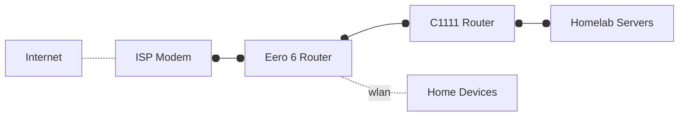
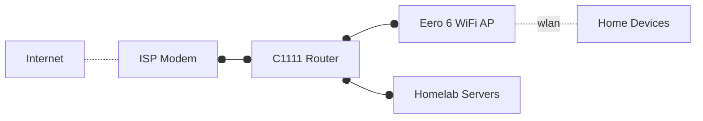

## :material-file-document-multiple: Decision Records

Architecture decisions play a crucial role in driving the design and development of a software project. They guide the selection of technologies, the design of software components, and the organization of the codebase. However, these decisions are often made in isolation and without proper documentation. This can lead to confusion, inconsistencies, and suboptimal solutions. Moreover, it makes it nearly impossible to answer questions like "why did we decide to do this? 🤔" as the time goes on.

Therefore, it is important to keep a record of architecture decisions, including the context, the decision itself, and the consequences. This practice, known as Architecture Decision Records (ADRs), fosters transparency, improves communication, and provides a historical context to help future decision-making.

This page contains a list of ADRs, both overarching (with cross-cutting concerns across the entirety of ktchn8s), as well as those specific to a given component.

We follow a simple template for documenting architecture decisions, which is inspired by this Michael Nygard's [post](http://thinkrelevance.com/blog/2011/11/15/documenting-architecture-decisions)

<!-- markdownlint-disable MD046 -->
??? Template

    \## AD-000X - Title

    > These documents have names that are short noun phrases. For example, "ADR 1: Deployment on Ruby on Rails 3.0.10" or "ADR 9: LDAP for Multitenant Integration"
    > We prefix the title with the ADR number for easier reference.

    **Context**

    > This section describes the forces at play, including technological, political, social, and project local. These forces are probably in tension, and should be called out as such. The language in this section is value-neutral. It is simply describing facts.

    **Decision**

    > This section describes our response to these forces. It is stated in full sentences, with active voice. "We will …"

    **Status**

    > A decision may be "proposed" if the project stakeholders haven't agreed with it yet, or "accepted" once it is agreed. If a later ADR changes or reverses a decision, it may be marked as "deprecated" or "superseded" with a reference to its replacement.
    > While it may not seem necessary to have 'status' section for a project with a single maintainer, decisions may also come from external parties, for example from discussions in pull-requests, so it is still useful to have this section and document these decisions, as well as reasoning behind i.e. rejecting a proposed change.

    **Consequences**

    > This section describes the resulting context, after applying the decision. All consequences should be listed here, not just the "positive" ones. A particular decision may have positive, negative, and neutral consequences, but all of them affect the team and project in the future.
<!-- markdownlint-enable MD046 -->


## AD-0001 - Plugging C1111 router directly into ISP modem

**Context**

Before I started home-labbing, our home network was managed via an Eero 6 router connected to the ISP modem.

I initially thought to connect the C1111 router to the Eero:



This would, however, result in Double-NAT, which is usually not recommended.

I found out that Eero can be used as an Access Point in this [post](https://www.reddit.com/r/eero/comments/uuuvdc/comment/i9hkazz/?utm_source=share&utm_medium=web3x&utm_name=web3xcss&utm_term=1&utm_content=share_button) by first wiring one eero to your existing router and setting it up in Double NAT. Once the setup is complete, you can go to the Settings --> Network Settings --> DHCP & NAT and select Bridge. Eero will restart and then work as an Access Point.

Therefore, I can use C1111 as the main (and only) router, and use the existing Eero 6 router as an AP.

**Decision**

- We will connect the C1111 router directly to the ISP modem, and connect Eero 6 to C1111, using Eero router as an AP.



**Status**

- Accepted

**Consequences**

- No Double-NAT
- Eero 6 will be used as an Access Point, which will allow us to use it for WiFi connectivity.
- Eero 6 in bridge mode has limited functionality (e.g. you won't be able to enable built-in security settings anymore)
    - This is not a big problem because we can ensure security via router or pfsense or something similar.

## AD-0002 - Disable GRUB_TIMEOUT

**Context**

Two of my machines (namely M70q Gen.2) won't go past GRUB unless keyboard is plugged in.

When I was bootstrapping my newer machines, two of them failed on a task that does periodic pings to wait for machine to come online. I plugged the monitor into one of them and found that it was hanging on the GRUB screen with the first option highlighted. So I needed to plug the keyboard back in and select the entry manually. Other machines start an automatic countdown whether they detect a kb or not, but on these no keyboard -> no countdown -> no boot, just stuck on the GRUB screen.

I've researched a bit and some suggest finding a BIOS setting that says "ignore keyboard errors" or something like that, but none of my Lenovos have such option.

So the alternative was to disable the GRUB timeout altogether.

**Decision**

- We will set `GRUB_TIMEOUT=0` and `GRUB_TIMEOUT_STYLE=hidden` to disable the GRUB menu and boot directly into the default entry.

**Status**

- Accepted

**Consequences**

- The system will boot directly into the default entry without showing the GRUB menu, so no need to fiddle with keyboards etc
- GRUB can still be accessed by holding down the <key>Shift</key> key during boot.
    - Some people report that holding <key>Shift</key> doesn't always work. See e.g. [Grub menu at boot time... "holding shift" not working](https://askubuntu.com/questions/668049/grub-menu-at-boot-time-holding-shift-not-working) for troubleshooting. 
- I've tested this on my M70q Gen.2 machines, and simply setting `GRUB_TIMEOUT=0` with `GRUB_TIMEOUT_STYLE=hidden` worked fine. However, if those settings don't seem to do anything, one might try a workaround as described in this [post](https://ubuntuforums.org/showthread.php?t=1287602&page=14&p=10097915#post10097915):

    > If the "GRUB_TIMEOUT=0" does not work, does your system begin a countdown when the menu displays or does it await input from you? If there is no countdown it's possible that grub is detecting a 'recordfail' and will wait for input. We can change that behaviour as well but by a different method.
    > 
    > For now, if the TIMEOUT setting doesn't work, open /etc/grub.d/00_header and go to approximately line 238:
    >
    > ```
    > gksu gedit +238 /etc/grub.d/00_header
    > ```
    >
    > Find this section and make the changes in dark red, then save the file and run "sudo update-grub".
    >
    > ```
    > make_timeout ()
    > {
    > cat << EOF
    > if [ "\${recordfail}" = 1 ]; then
    > set timeout=-1
    > else
    > 
    > # Manually change timeout to 0
    > # set timeout=${2}
    > set timeout=0
    > # End manual change
    > 
    > fi
    > EOF
    > }
    > ```
    >
    > This should eliminate the menu display unless there is a "recordfail" event. It also preserves the ability to display the menu by holding down the SHIFT key during boot. Please let me know if this solution works for you.
