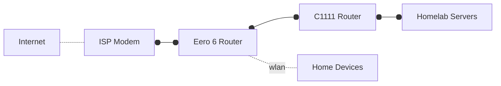
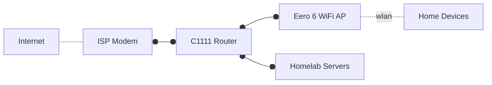

# :material-file-document-multiple: Architecture Decision Records

Architecture decisions play a crucial role in driving the design and development of a software project. They guide the selection of technologies, the design of software components, and the organization of the codebase. However, these decisions are often made in isolation and without proper documentation. This can lead to confusion, inconsistencies, and suboptimal solutions. Moreover, it makes it nearly impossible to answer questions like "why did we decide to do this? 🤔" as the time goes on.

Therefore, it is important to keep a record of architecture decisions, including the context, the decision itself, and the consequences. This practice, known as Architecture Decision Records (ADRs), fosters transparency, improves communication, and provides a historical context to help future decision-making.

This page contains a list of ADRs, both overarching (with cross-cutting concerns across the entirety of ktchn8s), as well as those specific to a given component.

We follow a simple template for documenting architecture decisions, which is inspired by this Michael Nygard's [post](http://thinkrelevance.com/blog/2011/11/15/documenting-architecture-decisions)

<!-- markdownlint-disable MD046 -->
??? Template

    \## AD-000X - Title

    > These documents have names that are short noun phrases. For example, "ADR 1: Deployment on Ruby on Rails 3.0.10" or "ADR 9: LDAP for Multitenant Integration"
    > We prefix the title with the ADR number for easier reference.

    **Context**

    > This section describes the forces at play, including technological, political, social, and project local. These forces are probably in tension, and should be called out as such. The language in this section is value-neutral. It is simply describing facts.

    **Decision**

    > This section describes our response to these forces. It is stated in full sentences, with active voice. "We will …"

    **Status**

    > A decision may be "proposed" if the project stakeholders haven't agreed with it yet, or "accepted" once it is agreed. If a later ADR changes or reverses a decision, it may be marked as "deprecated" or "superseded" with a reference to its replacement.
    > While it may not seem necessary to have 'status' section for a project with a single maintainer, decisions may also come from external parties, for example from discussions in pull-requests, so it is still useful to have this section and document these decisions, as well as reasoning behind i.e. rejecting a proposed change.

    **Consequences**

    > This section describes the resulting context, after applying the decision. All consequences should be listed here, not just the "positive" ones. A particular decision may have positive, negative, and neutral consequences, but all of them affect the team and project in the future.
<!-- markdownlint-enable MD046 -->


## AD-0001 - Plugging C1111 router directly into ISP modem

**Context**

Before I started home-labbing, our home network was managed via an Eero 6 router connected to the ISP modem.

I initially thought to connect the C1111 router to the Eero:


```mermaid
flowchart LR
    I[Internet] -.- M[ISP Modem] o--o E[Eero 6 Router] o--o C[C1111 Router]
    E -.- |wlan| D[Home Devices]
    C o--o H[Homelab Servers]
```

This would, however, result in Double-NAT, which is usually not recommended.

I found out that Eero can be used as an Access Point in this [post](https://www.reddit.com/r/eero/comments/uuuvdc/comment/i9hkazz/?utm_source=share&utm_medium=web3x&utm_name=web3xcss&utm_term=1&utm_content=share_button) by first wiring one eero to your existing router and setting it up in Double NAT. Once the setup is complete, you can go to the Settings --> Network Settings --> DHCP & NAT and select Bridge. Eero will restart and then work as an Access Point.

Therefore, I can use C1111 as the main (and only) router, and use the existing Eero 6 router as an AP.

**Decision**

- We will connect the C1111 router directly to the ISP modem, and connect Eero 6 to C1111, using Eero router as an AP.


```mermaid
flowchart LR
    I[Internet] -.- M[ISP Modem] o--o C[C1111 Router] o--o E[Eero 6 WiFi AP]
    E -.- |wlan| D[Home Devices]
    C o--o H[Homelab Servers]
```

**Status**

- Accepted

**Consequences**

- No Double-NAT
- Eero 6 will be used as an Access Point, which will allow us to use it for WiFi connectivity.
- Eero 6 in bridge mode has limited functionality (e.g. you won't be able to enable built-in security settings anymore)
    - This is not a big problem because we can ensure security via router or pfsense or something similar.

## AD-0002 - Disable GRUB_TIMEOUT

**Context**

Two of my machines (namely M70q Gen.2) won't go past GRUB unless keyboard is plugged in.

When I was bootstrapping my newer machines, two of them failed on a task that does periodic pings to wait for machine to come online. I plugged the monitor into one of them and found that it was hanging on the GRUB screen with the first option highlighted. So I needed to plug the keyboard back in and select the entry manually. Other machines start an automatic countdown whether they detect a kb or not, but on these no keyboard -> no countdown -> no boot, just stuck on the GRUB screen.

I've researched a bit and some suggest finding a BIOS setting that says "ignore keyboard errors" or something like that, but none of my Lenovos have such option.

So the alternative was to disable the GRUB timeout altogether.

**Decision**

- We will set `GRUB_TIMEOUT=0` and `GRUB_TIMEOUT_STYLE=hidden` to disable the GRUB menu and boot directly into the default entry.

**Status**

- Accepted

**Consequences**

- The system will boot directly into the default entry without showing the GRUB menu, so no need to fiddle with keyboards etc
- GRUB can still be accessed by holding down the <key>Shift</key> key during boot.
    - Some people report that holding <key>Shift</key> doesn't always work. See e.g. [Grub menu at boot time... "holding shift" not working](https://askubuntu.com/questions/668049/grub-menu-at-boot-time-holding-shift-not-working) for troubleshooting.
- I've tested this on my M70q Gen.2 machines, and simply setting `GRUB_TIMEOUT=0` with `GRUB_TIMEOUT_STYLE=hidden` worked fine. However, if those settings don't seem to do anything, one might try a workaround as described in this [post](https://ubuntuforums.org/showthread.php?t=1287602&page=14&p=10097915#post10097915):

    > If the "GRUB_TIMEOUT=0" does not work, does your system begin a countdown when the menu displays or does it await input from you? If there is no countdown it's possible that grub is detecting a 'recordfail' and will wait for input. We can change that behaviour as well but by a different method.
    >
    > For now, if the TIMEOUT setting doesn't work, open /etc/grub.d/00_header and go to approximately line 238:
    >
    > ```
    > gksu gedit +238 /etc/grub.d/00_header
    > ```
    >
    > Find this section and make the changes in dark red, then save the file and run "sudo update-grub".
    >
    > ```
    > make_timeout ()
    > {
    > cat << EOF
    > if [ "\${recordfail}" = 1 ]; then
    > set timeout=-1
    > else
    >
    > # Manually change timeout to 0
    > # set timeout=${2}
    > set timeout=0
    > # End manual change
    >
    > fi
    > EOF
    > }
    > ```
    >
    > This should eliminate the menu display unless there is a "recordfail" event. It also preserves the ability to display the menu by holding down the SHIFT key during boot. Please let me know if this solution works for you.

## AD-0003 - NAS directory layout grammar

**Context**

The NAS (`yggdrasil`) needed a directory structure before migrating ~16TB of semi-structured backups onto it. Renaming directories after creation is punished by the whole stack: snapraid re-syncs parity, rsync-style backups re-copy, and NFS-mounted PVs reference paths in Helm values. The structure must be navigable from memory at the shell (primary consumer) while services expose subtrees to the household. An earlier vault-style deep numbering scheme (`300/310/310.01`) proved heavy in practice — the third digit exists only to encode a third numbering level.

Full design: [NAS storage layout](../../wip/nas-storage-layout/design.md).

**Decision**

- We will use a two-level numeric grammar: two-digit decade prefixes at the top level (`10_documents`, `30_media`), `NN.MM_` at the second level (`30.01_movies`), and **no numbering below two levels** — deeper directories use plain names.
- We will always use two digits at both levels so lexicographic sort is correct everywhere (`ls`, NFS clients, web UIs) up to 99 children — chosen while the tree was empty, because the never-rename rule makes padding unfixable later.
- We will never rename a numbered directory and never recycle a number; retired categories get an entry in `00_meta/RETIRED.md` and the number stays burned.
- We will encode ownership in the name at the two numbered levels: **numbered = human-curated and snapraid-parity-protected; unnumbered lowercase (`rotation/`, `inbox/`) = machine-owned and parity-excluded** — deeper plain-named dirs inherit their ancestor's tier. The parity excludes are **root-anchored paths** (`/30_media/rotation/`, `/10_documents/inbox/`, `/99_tmp/`), never bare names, which would silently deep-match same-named dirs inside `70_backups` dumps. One deliberate exception: `20.02_camera` is numbered and parity-protected yet machine-fed (camera dumps are the sole copy until promotion).
- We will document the tree twice from one source: `00_meta/README.md` on the NAS (templated by the storage role from the same variable that creates the dirs) and a legend note in the Obsidian vault.

**Status**

- Accepted

**Consequences**

- "Find it in 10.02" is unambiguous, and one glance at any path tells you who owns it and whether parity covers it.
- The tree is rename-proof by construction; extension is additive (new numbers, never reshuffling).
- The layout is decoupled from the Obsidian vault taxonomy — reorganizing the vault cannot break the NAS.
- Sort-correctness caps each level at 99 children; if a category ever needs more, the taxonomy has failed, not the padding.
- Enforced in `metal/roles/storage` (`storage_dirs` + README template) and `snapraid.conf.j2` excludes.

## AD-0004 - Single-PVC subPath topology for hardlink-dependent workloads

**Context**

The media stack (transmission + Radarr/Sonarr + Jellyfin) relies on hardlinks: the torrent client must keep the original file name to continue seeding while the library carries the renamed copy — one inode, two names, storage consumed once. The kernel's `EXDEV` check in `link(2)`/`rename(2)` compares **vfsmounts, not devices**: every Kubernetes volumeMount — including each `subPath` projection — is a distinct bind mount, so hardlinks fail across two mounts *even of the same PVC with identical `st_dev`* (empirically reproduced 2026-08-22 during design review: cross-bind-mount `ln` → "Invalid cross-device link"; single-parent-mount `ln` → success). The *arr applications catch `EXDEV` and silently fall back to copying (double storage, orphaned seeds). On the NAS side, mergerfs's non-path-preserving `mfs` create policy supports hardlinks pool-wide ([mergerfs FAQ](https://trapexit.github.io/mergerfs/latest/faq/why_isnt_it_working/)).

**Decision**

- We will nest the **entire machine tier under one parent**: `30_media/rotation/{downloads,movies,shows}` — so that a single mount contains every path an importing container links across.
- We will give each linking container (Radarr, Sonarr) **exactly one volumeMount** from the media PVC (`subPath: rotation` at `/data`); transmission mounts only `rotation/downloads` at `/data/downloads` (least privilege, identical path strings); Jellyfin's multiple read-only mounts are fine because it never links.
- We will never mount the NAS root into any pod to "solve" cross-subtree linking.

**Status**

- Accepted (amended 2026-08-22, same day: the original wording claimed multiple `subPath` mounts of one PVC suffice for hardlinks — refuted empirically during design review; see `docs/wip/nas-storage-layout/design-review.md`)

**Consequences**

- Hardlink imports and instant promotion moves (`mv rotation/… → 30.0x/…`) work; storage is consumed once per file regardless of how many names it has.
- The torrent-exposed blast radius is exactly `30_media` — documents and photos are unreachable from the media stack.
- The topology is fragile to well-meaning refactors: splitting a linking container's single `rotation` mount into per-dir `subPath` mounts (or per-dir PVs) silently degrades imports to copies. Detection signal: `30_media` usage ≈2× expected, or `stat -c %h` on an imported file returning 1 while seeding. Documented in the design's failure-mode narrative.
- Future *arr root folders (music, books) extend inside `rotation/` with no topology change.

## AD-0005 - Two-tier content flow: machines feed, humans promote

**Context**

Radarr/Sonarr delete and replace library files on quality upgrades — an *arr-managed library can never hold "preserved" content safely. Similarly, Immich's external libraries are not read-only by design: with a read-write mount, emptying Immich's trash (30-day auto-purge) deletes original files from disk ([Immich libraries docs](https://docs.immich.app/features/libraries/)). Meanwhile albums, people, and favorites live only in Immich's database in *both* mount modes, so a read-write mount would not buy metadata portability — only deletion risk.

**Decision**

- We will split every service-fed content area into a machine tier and a human tier: media `rotation/` → `30.0x` preserved dirs; photos `20.02_camera` (triage) and Immich-owned uploads (Ceph) → `20.01_library` (archive).
- We will promote content exclusively by hand (`mv`) — human curation is the feature, not a gap to automate.
- We will mount preserved tiers read-only in every service that touches them: Jellyfin gets **all** media mounts `:ro` (it writes nothing; deletions flow Jellyseerr → *arr APIs), Immich gets `20.01_library` `:ro` and `20.02_camera` read-write (in-app culling of camera dumps deletes rejects from disk *by intent*).
- We will treat the filesystem as the metadata source of truth for the photo archive: date/GPS repairs happen via exiftool/digiKam on the tree; Immich re-reads them on rescan.

**Status**

- Accepted

**Consequences**

- Automation physically cannot delete preserved content — the boundary is kernel-enforced (`EROFS`), not service-configuration hope.
- Jellyfin watch state is typically lost on promotion (it identifies items by path) — promote what has been watched, or accept the reset.
- Metadata edited inside Immich on the read-only archive persists only in its DB and silently no-ops on files — the Immich DB must be backed up regardless (albums/faces live only there).
- The rotation tier is parity-excluded and unprotected by design: its content is re-downloadable, and excluding its churn keeps snapraid's `delete_threshold`/`update_threshold` abort heuristics meaningful.

## AD-0006 - Services mount scoped plain-directory subtrees

**Context**

The NAS layout must outlive any particular service choice (Nextcloud vs Copyparty vs OpenCloud; Jellyfin vs Plex; possible future SMB access; possible future ZFS migration). Some self-hosting services store data in proprietary on-disk formats (e.g. Seafile's chunked block store), which would make the directory tree unreadable without the service. Others (Immich uploads, Nextcloud datadir, paperless media) manage churning internal state that doesn't belong on a parity-protected spinning-disk pool.

**Decision**

- We will expose the NAS to services only as scoped plain-directory subtrees — one NFS PV per subtree, never the root — read-only wherever the service doesn't need to write.
- We will disqualify services that require a proprietary on-disk format for the data they serve (this ruled out Seafile).
- We will keep service-owned state (databases, upload stores, thumbnails, config) on cluster storage (Ceph), never inside the human tree.
- We will alias share names away from the numbers (`media` → `30_media`, `photos` → `20_photos`) so external names stay stable and a future SMB layer can export the same aliases with zero restructuring.

**Status**

- Accepted

**Consequences**

- Every file on the NAS remains readable with nothing but a filesystem — no service lock-in; a future ZFS (or any other) migration is a plain copy.
- New shares cost one values entry in `system/csi-driver-nfs` (single root export with `fsid=1` serves subpath mounts; zero NAS-side export changes).
- Service selection for documents (Nextcloud/Copyparty/OpenCloud) stays an open, deferred decision — the tree doesn't depend on it.
- Machine-generated churn never lands on the snapraid pool, keeping parity syncs quiet and meaningful.

## AD-0007 - Migration integrity via content-hash manifests and staged drive release

**Context**

The initial data load (~16TB) comes from backup drives that will themselves become the pool's parity drives — during migration the pool has no parity, and the source drives are the only redundancy. Before wiping any source drive we must prove no unique content is lost. The drives hold different backup generations whose directory layouts differ, so path-based comparison (`rsync -c`) would both re-read the NAS copy once per drive (~days of redundant spinning-disk I/O) and report moved files as missing.

**Decision**

- We will verify with BLAKE3 content-hash manifests (`b3sum`), one per dataset (NAS copy, each source drive), compared as **hash-sets** ("is any content on drive B present nowhere in the copy?") — immune to renames between backup generations, reading each dataset exactly once, parallelizable across machines.
- We will keep the manifests, the move log, and the conscious-discard log permanently in `00_meta/migration/` as the audit record of what came from where and where it went.
- We will release source drives one at a time, and wipe the **last** source drive only after the first snapraid sync **and** scrub complete successfully — the pool is never simultaneously parity-less and source-less.

**Status**

- Accepted

**Consequences**

- "Safe to wipe" is a provable statement (empty hash-set diff + logged discards), not a feeling.
- Any file's integrity can be re-verified by hash forever, even after sorting scattered it across the tree.
- The migration window is longer than a copy-and-wipe approach — hashing 16TB per dataset is disk-bound (~a day per drive) — accepted as the price of the proof.
- `b3sum` becomes a dev-shell dependency (`flake.nix`).

## AD-0008 - Helm chart pinning strategy

**Context**

Decided 2026-08-18 during the `nfs` branch pre-merge review; originally recorded in [todo.md](../../info/todo.md) and lifted here.

All Helm charts in this repo declare upstream dependencies in `Chart.yaml`. Three supply-chain postures were on the table: exact version pins with automated bumps, committing `Chart.lock` files, and vendoring the dependency archives (`charts/*.tgz`) into git. Two facts shaped the evaluation: `Chart.lock`'s digest hashes dependency *metadata*, not tarball content — so it verifies neither integrity nor reproducibility when versions are already exact-pinned; and with the cluster running continuously, chart repositories are only contacted at sync/render time — a failed render leaves the last-synced state running, so an upstream outage delays updates rather than breaking workloads.

**Decision**

- We will pin exact chart versions in `Chart.yaml` and let Renovate propose daily bumps.
- We will not commit `Chart.lock` files and not vendor `charts/*.tgz` archives — both stay gitignored.

**Status**

- Accepted

**Consequences**

- Updates are deliberate, reviewable version bumps; no lockfile churn or binary blobs in git history.
- With exact pins, `Chart.lock` would add no integrity or reproducibility guarantee — omitting it removes noise, not protection.
- Accepted residual risk: a full cluster rebuild while an upstream repo is down or has pruned the pinned version requires bumping to an available version first.
- Code reviews should not re-flag missing `Chart.lock` files — this is a decision, not an oversight.
