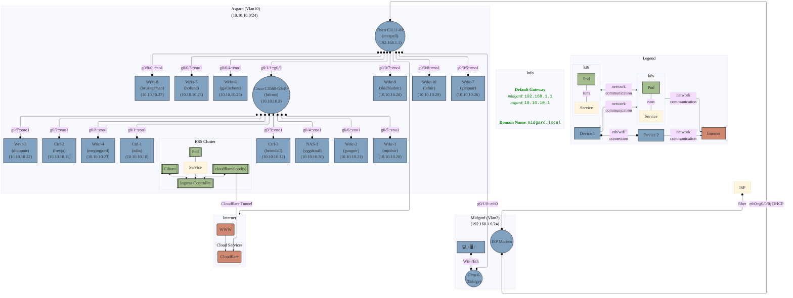

# :material-lan: Network Overview

```mermaid
%% mermaid config https://mermaid.js.org/config/schema-docs/config.html#theme
%%{init: {
  "theme": "base",
  "flowchart": {"defaultRenderer": "elk", "curve": "linear", "markdownAutoWrap":"false", "wrappingWidth": "800"},
  'themeVariables': { "fontSize": "24px", "fontFamily": "IBM Plex Sans" }
} }%%
graph TB
    subgraph GrL[Legend]
      direction LR
      LD1@{ shape: rect, label: "Device 1" }
      LD2@{ shape: rect, label: "Device 2" }
      LS2@{ shape: rect, label: "Service"}
      LI@{ shape: rect, label: "Internet"}

      LD1 o--o |eth/wifi<br>connection| LD2
      LD2  --> |network<br>communication| LI
      LD1  --> |network<br>communication| GrLS1

      subgraph GrLS1[k8s]
        direction TB
        LP1@{ shape: rect, label: "Pod" }
        LS1@{ shape: rect, label: "Service"}

        LP1  --- |runs| LS1
      end

      subgraph GrLS2[k8s]
        direction TB
        LP2@{ shape: rect, label: "Pod" }
        LS2@{ shape: rect, label: "Service"}

        LP2  --- |runs| LS2
      end
      GrLS2 <--> |network<br>communication| GrLS1
      GrLS1  --> |network<br>communication| LI
    end

    subgraph Info
        homelab_info@{ shape: text, label: "
             **Default Gateway**
             *midgard*: <code>192.168.1.1</code>
             *asgard*:  <code>10.10.10.1</code>
             <br>
             **Domain Name**: <code>midgard.local</code>
        " }
    end

    subgraph GrHL["Asgard (Vlan10)<br>(10.10.10.0/24)"]
        %% cisco switch
        C3560@{ shape: circle, label: "Cisco C3560-GS-8P<br>(bifrost)<br>(10.10.10.2)" }

        %% k8s devices
        %% control plane
        A@{ shape: rect, label: "Ctrl-1<br>(odin)<br>(10.10.10.10)" }
        B@{ shape: rect, label: "Ctrl-2<br>(freyja)<br>(10.10.10.11)" }
        C@{ shape: rect, label: "Ctrl-3<br>(heimdall)<br>(10.10.10.12)" }
        %% worker nodes
        D@{ shape: rect, label: "Wrkr-1<br>(mjolnir)<br>(10.10.10.20)" }
        E@{ shape: rect, label: "Wrkr-2<br>(gungnir)<br>(10.10.10.21)" }
        F@{ shape: rect, label: "Wrkr-3<br>(draupnir)<br>(10.10.10.22)" }
        G@{ shape: rect, label: "Wrkr-4<br>(megingjord)<br>(10.10.10.23)" }
        H@{ shape: rect, label: "Wrkr-5<br>(hofund)<br>(10.10.10.24)" }
        I@{ shape: rect, label: "Wrkr-6<br>(gjallarhorn)<br>(10.10.10.25)" }
        J@{ shape: rect, label: "Wrkr-7<br>(gleipnir)<br>(10.10.10.26)" }
        K@{ shape: rect, label: "Wrkr-8<br>(brisingamen)<br>(10.10.10.27)" }
        L@{ shape: rect, label: "Wrkr-9<br>(skidbladnir)<br>(10.10.10.28)" }
        M@{ shape: rect, label: "Wrkr-10<br>(lafnir)<br>(10.10.10.29)" }
        %% nas devices
        S1@{ shape: rect, label: "NAS-1<br>(yggdrasil)<br>(10.10.10.30)" }

        C3560 o--o   |g0/1::eno1| A
        C3560 o--o   |g0/2::eno1| B
        C3560 o--o   |g0/3::eno1| C
        C3560 o--o   |g0/4::eno1| S1
        C3560 o--o   |g0/5::eno1| D
        C3560 o--o   |g0/6::eno1| E
        C3560 o--o   |g0/7::eno1| F
        C3560 o--o   |g0/8::eno1| G
        C1111 o--o |g0/0/3::eno1| H
        C1111 o--o |g0/0/4::eno1| I
        C1111 o--o |g0/0/5::eno1| J
        C1111 o--o |g0/0/6::eno1| K
        C1111 o--o |g0/0/7::eno1| L
        C1111 o--o |g0/0/8::eno1| M

        subgraph GrKC["K8S Cluster"]
            IC@{ shape: subproc, label: "Ingress Controller" }
            CFD@{ shape: subproc, label: "cloudflared pod(s)" }
            LB@{ shape: subproc, label: "Cilium" }
            PD@{ shape: subproc, label: "Pod" }
            SVC@{ shape: rect, label: "Service" }

            CFD <--> IC
            SVC  --> IC
            LB  <--> IC
            PD   --- SVC
        end
    end

    ISP@{ shape: rect, label: "ISP" }

    subgraph GrHN["Midgard (Vlan2)<br>(192.168.1.0/24)"]
        direction TB

        DV@{ shape: rect, label: "💻 / 🖥️ / 📱" }
        ISPM@{ shape: circle, label: "ISP Modem" }
        EER@{ shape: circle, label: "Eero 6<br>(Bridge)" }
        C1111@{ shape: circle, label: "Cisco C1111-8P<br>(muspell)<br>(192.168.1.1)" }

        %% physical connections
        ISPM  o--o |eth0::g0/0/0; DHCP| C1111
        DV    o--o |WiFi/Eth| EER
        C1111 o--o |g0/1/0::eth0| EER
        C1111 o--o |g0/1/1::g0/9| C3560
    end

    ISP   o--o |fiber| ISPM
    C1111  --> GrI

    subgraph GrI[Internet]
        direction LR
        W3@{ shape: rounded, label: "WWW" }

        subgraph "Cloud Services"
            CF@{ shape: rounded, label: "Cloudflare" }
        end

        W3 --> CF
        CFD  --> |Cloudflare Tunnel| CF
    end

    %% Styling

    classDef cloud  fill:#d08770,stroke:#333,stroke-width:2px
    classDef device fill:#81a1c1,stroke:#333,stroke-width:2px
    classDef pod    fill:#a3be8c,stroke:#333,stroke-width:2px

    classDef text color:green
    class homelab_info text

    class W3,CF cloud
    class A,B,C,D,E,F,G,H,I,J,K,L,M,S1,C1111,C3560,DV,ISPM,EER device
    class IC,CFD,LB,PD pod

    %% legend elements separately for readability
    class LD1,LD2 device
    class LI cloud
    class LP1,LP2 pod
    class LS1,LS2 service
```
