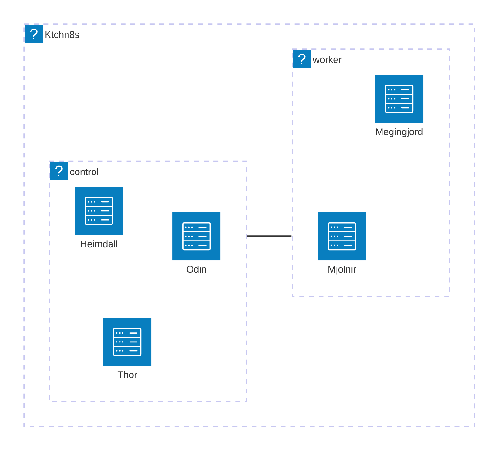

# :material-earth: Overview

## Components

Main:

```mermaid
architecture-beta
    group home(logos:kubernetes)[Ktchn8s]

    group control(logos:control)[control] in home
    group worker(logos:worker)[worker] in home

    service odin(server)[Odin] in control
    service thor(server)[Thor] in control
    service heimdall(server)[Heimdall] in control

    service mjolnir(server)[Mjolnir] in worker
    service megingjord(server)[Megingjord] in worker

    odin{group}:R -- L:mjolnir{group}

    %% service db(database)[Database] in api
    %% service disk1(disk)[Storage] in api
    %% service disk2(disk)[Storage] in api
    %% service server(server)[Server] in api

    %% db:L -- R:server
    %% disk1:T -- B:server
    %% disk2:T -- B:db
```

- ...

Other:

- `./docs`: documentation, written in Markdown and served with [mkdocs](https://www.mkdocs.org/)
