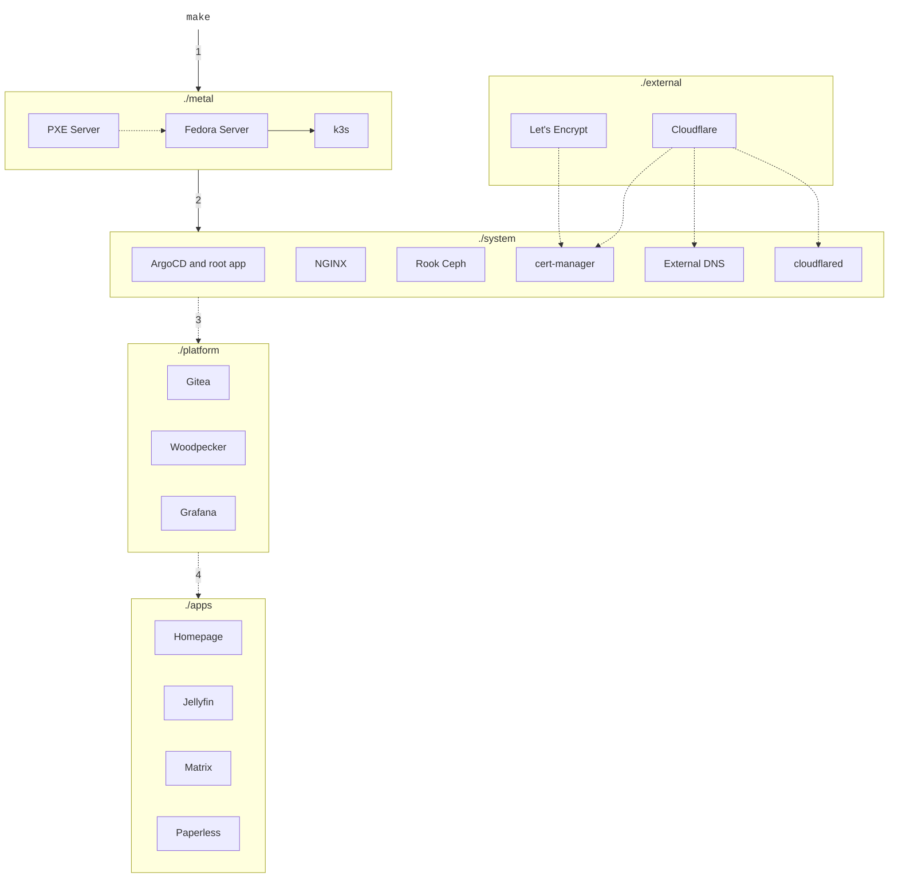

# :material-earth: Overview

## Components

### Main

```mermaid
architecture-beta
    group home(si:kubernetes)[ktchn8s]

    group control(mdi:account-tie-hat) in home
    group worker(mdi:worker) in home
    group storage(mdi:network-attached-storage) in home

    service odin(server)[Odin] in control
    service freyja(server)[Freyja] in control
    service heimdall(server)[Heimdall] in control

    service draupnir(server)[Draupnir] in worker
    service megingjord(server)[Megingjord] in worker

    service yggdrasil(server)[Yggdrasil] in storage
    service disks(disk) in storage

    yggdrasil:B -- T:disks

    odin{group}:R <--> L:draupnir{group}
    odin{group}:B <--> T:yggdrasil{group}
    megingjord{group}:L <--> R:yggdrasil{group}

    %% External Services

    group external(mdi:cloud)[External]

    service cloudflare(si:cloudflare)[Cloudflare] in external
    service letsencrypt(si:letsencrypt)[LetsEncrypt] in external

    cloudflare{group}:B <--> T:heimdall{group}
```



From code perspective, the above looks as follows:

<!-- https://en.wikipedia.org/wiki/Box_Drawing -->

```
┌──────────────┐
│  ./apps      │        ┌────────────┐
│  ./platform  │<------>│ ./external │
│  ./system    │        └────────────┘
│  ./metal     │
├──────────────┤
┊   HARDWARE   ┊
└┄┄┄┄┄┄┄┄┄┄┄┄┄┄┘
```

- `./metal`: bare metal provisioning (install and configure Linux, Kubernetes, etc.)
- `./system`: critical system components for the cluster (load balancer, storage, ingress, operation tools...)
- `./platform`: components for service hosting platform (git, build runners, dashboards...)
- `./apps`: user facing applications
- `./external`: (optional) services that live outside of the cluster

### Other

- `./docs`: documentation written in Markdown and served with [mkdocs](https://www.mkdocs.org/)
- `./scripts`: common tasks that I can't be bothered to do manually

## Provisioning Flow

- (1) Build the `./metal` layer:
    - Create an ephemeral, stateless PXE server
    - Install Linux on all servers in parallel
    - Build a Kubernetes cluster (based on [k3s](https://k3s.io/))
- (2) Bootstrap the `./system` layer:
    - Install ArgoCD and the root app to manage itself and other layers
        - NB! From now on ArgoCD will do the rest
    - Install the remaining components (storage, monitoring, etc)
- (3) Build the `./platform` layer (Gitea, Grafana, SSO, etc)
- (4) Deploy applications in the `./apps` layer


