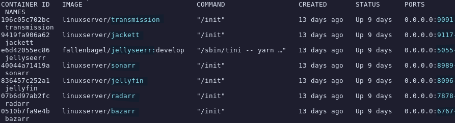
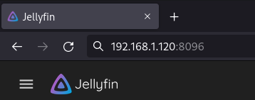
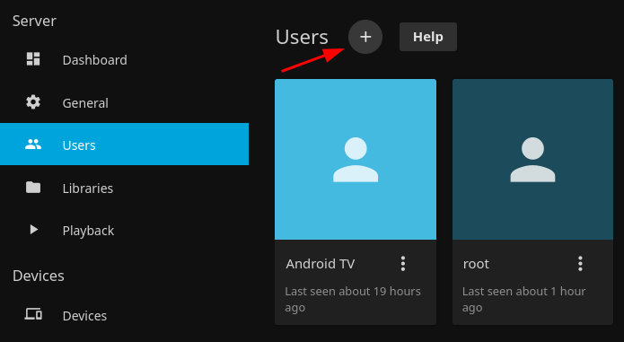
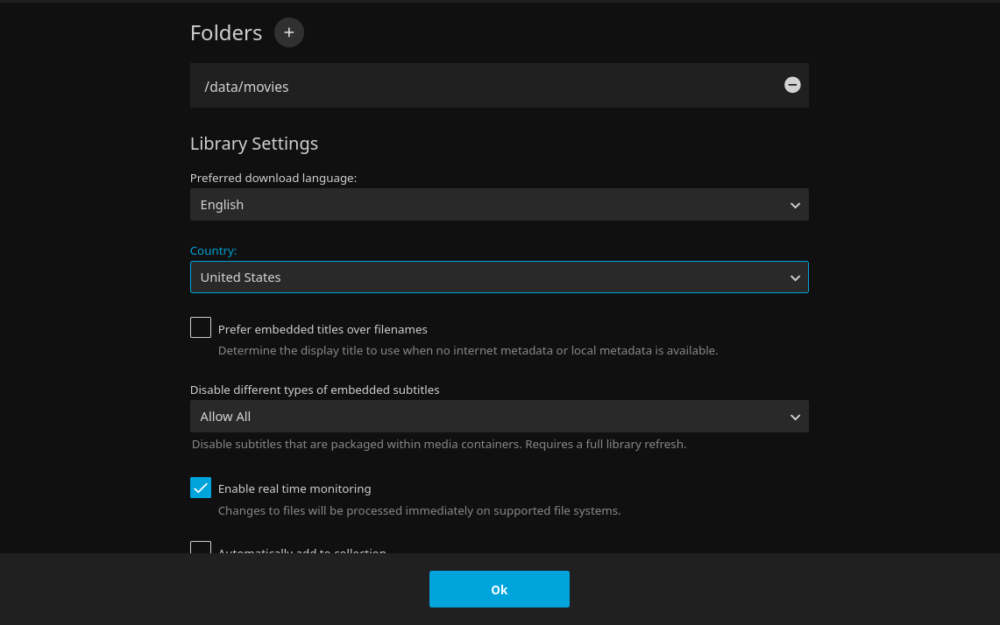
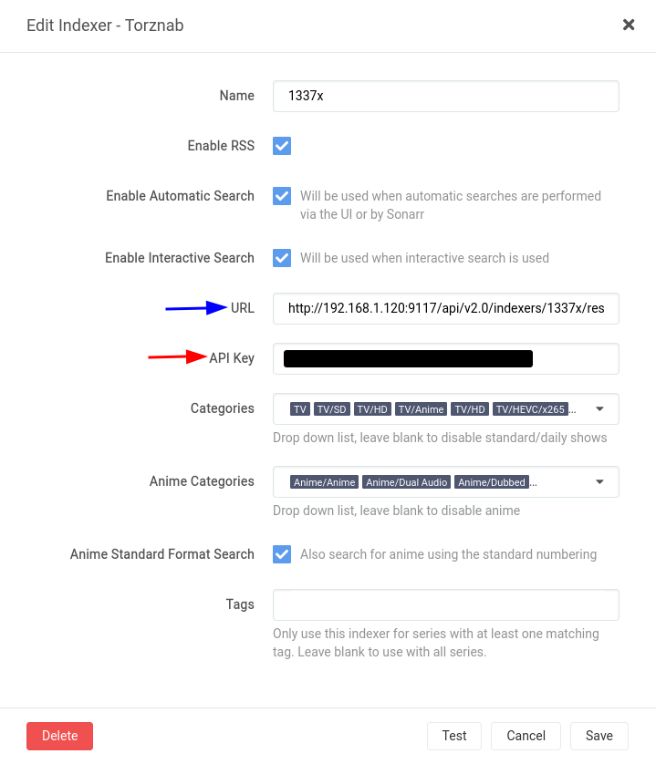
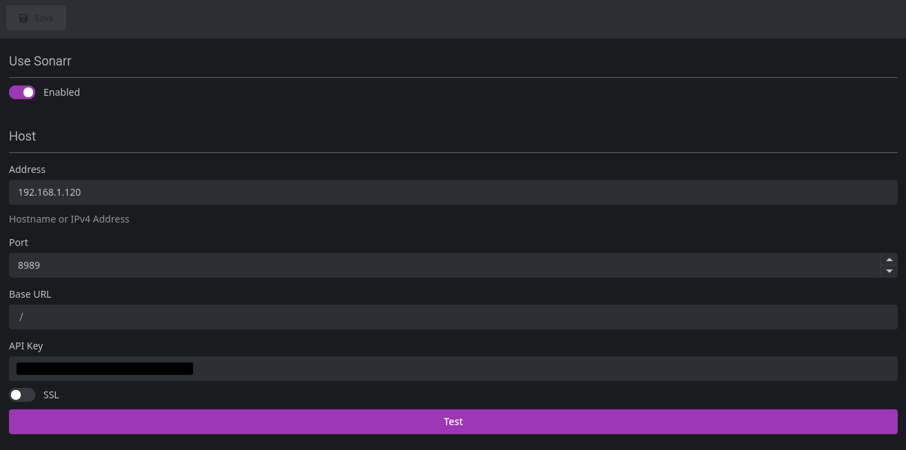

Self-hosting a media stack on your own personal server gives you full privacy and complete control over your data.

This guide will teach you how to set up a media stack on Linux using only Free Open Source Software.  
  
By following this post you will end up with a system ready to handle requests, downloads, and streaming of your favorite content (be it movies, tv shows, or anime) right at home, on your local network.  
And hopefully you will learn something new too!  
  
Note that you can further improve this setup based on your own needs, like running Transmission behind a VPN, or opening Jellyfin and Jellyseerr to the internet.  
While these are not covered here, this guide will serve as a solid base if you ever want to enhance its capabilities.

> DISCLAIMER: This article serves educational purposes only.

Now then, let's start!

## Requirements

- Basic Linux and Docker (Docker Compose) knowledge
- A Linux server (I recommend at least 4GB of RAM)
- Enough storage to store your media

## Media Stack

All of the listed software is Free and Open Source.

- **Jellyfin** \- streams media from the server to different clients
- **Sonarr** \- manages TV shows (and anime) and sends requests to Jackett
- **Radarr** \- manages movies and sends requests to Jackett
- **Jackett** \- parses results coming from Radarr and Sonarr and finds available torrents for such media
- **Transmission** \- torrent client to download media
- **Jellyseerr** \- webapp for users to discover and request movies and TV shows
- **Bazarr** \- scans available media and downloads subtitles for it

### How does this work?

- Users browse and discover movies and TV shows in Jellyseerr.
- Once they request a movie or TV show, Jellyseerr sends a query to Radarr and Sonarr respectively, which finds movies/shows by scraping on The Movie Database (TMDb).
- Radarr/Sonarr in turn sends a query to Jackett to look for the movies/shows in torrent indexers.
- Once a movie or TV show with all the requirements met is found in a torrent indexer, Radarr/Sonarr sends the magnet link to Transmission to download the movie from the torrent network.
- Once Transmission downloads the movie, it creates a hard link in the specified directories of Radarr/Sonarr.
- Bazaar scans those directories, then finds and downloads subtitles for the new movies/shows it finds after looking for them in famous subtitles websites.
- In the same way, Jellyfin periodically scans those directories as well and adds the new movies/shows to the correct library so that they can be streamed on multiple devices.

Here is a simplified flowchart I made which should explain this fairly easily:


### Alternatives

**Jackett alternative:**[Prowlarr](https://github.com/Prowlarr/Prowlarr).  
Unfortunately I found that it lacked support of Torrent indexers for foreign languages and decided to go with Jackett.  
If you intend to only download movies and shows in english then this won't be a problem.

**Jellyseerr alternative:**[Ombi](https://github.com/Ombi-app/Ombi).  
It features a smartphone app, but it is paid and each user would have to pay for it.  
You could connect to the the webapp using a browser just like you would with Jellyseerr, however I find the interface to be very bad on small screens and it seems to have worse suggestions in my experience.

**Transmission alternative:** Any other torrent client.  
I tried [qBittorrent](https://github.com/linuxserver/docker-qbittorrent) before Transmission, but for some reason I couldn't login when using certain browsers.

I still encourage you to try these alternatives for yourself, especially because they may have gotten better since the time of writing this.

## Setting up Docker

You must have both [Docker](https://docs.docker.com/get-docker/) and [Docker Compose](https://docs.docker.com/compose/) installed on your server.

Depending on your Linux distribution, you can follow the [installation instructions](https://docs.docker.com/engine/install/) on the official website.

If you're lazy and have a Debian-based server, you can use [Dockeraise](https://github.com/Zerodya/dockeraise), a script written by me (shameless self-promotion time!) to quickly install and configure `docker` and `docker-compose`.

If you want to go with the latter, you can use this command:

```bash
wget -qO- https://raw.githubusercontent.com/Zerodya/dockeraise/main/dockeraise.sh | bash
```

## Creating the containers

Now that Docker is installed, it's time to actually create our containers.

For this, I actually chose to divide the stack in two parts:

- **Streaming stack:** Jellyfin, Sonarr, Radarr, Bazarr, Jellyseerr.
- **Downloading stack:** Jackett, Transmission.

Creating the containers is quite simple:

1. Create two directories, one for each stack.
2. Create a file called **docker-compose.yml** in both directories.
3. Copy and paste the configurations below in each file.  
	(You can also get them from my [GitHub repo](https://github.com/Zerodya/docker-compose))

(If you don't know where to create these directories, a good tradition is to put them inside the `/srv/` directory. So you will have `/srv/streaming-stack/` and `/srv/downloading-stack/`)

Make sure to customize them in a way that suits your needs, such as changing the timezone (TZ).

**Note:** If you want to use Transmission behind a **VPN** use the docker-compose file of the [docker-transmission-openvpn](https://github.com/haugene/docker-transmission-openvpn) project, then configure the VPN as explained in their [documentation](https://haugene.github.io/docker-transmission-openvpn/).  
Another interesting project about VPN in a container is [Gluetun](https://github.com/qdm12/gluetun).

```yaml
version: "3"
services:
  jellyfin:
    image: jellyfin/jellyfin
    container_name: jellyfin
    environment:
      - PUID=1000
      - PGID=1000
      - TZ=Europe/Rome
    volumes:
      - ./jellyfin_config:/config
      - /media/tvshows:/data/tvshows
      - /media/movies:/data/movies
      - /media/anime:/data/anime
    ports:
      - 8096:8096
    restart: unless-stopped

  sonarr:
    image: linuxserver/sonarr
    container_name: sonarr
    environment:
      - PUID=1000
      - PGID=1000
      - TZ=Europe/Rome
    volumes:
      - ./sonarr_config:/config
      - /media/anime:/anime
      - /media/tvshows:/tvshows
      - /media/transmission/downloads/complete:/downloads/complete
    ports:
      - 8989:8989
    restart: unless-stopped

  radarr:
    image: linuxserver/radarr
    container_name: radarr
    environment:
      - PUID=1000
      - PGID=1000
      - TZ=Europe/Rome
    volumes:
      - ./radarr_config:/config
      - /media/transmission/downloads/complete:/downloads/complete
      - /media/movies:/movies
    ports:
      - 7878:7878
    restart: unless-stopped

  bazarr:
    image: linuxserver/bazarr
    container_name: bazarr
    environment:
      - PUID=1000
      - PGID=1000
      - TZ=Europe/Rome
    volumes:
      - ./bazarr_config:/config
      - /media/movies:/movies #optional
      - /media/tvshows:/tvshows #optional
      - /media/anime:/anime
    ports:
      - 6767:6767
    restart: unless-stopped

  jellyseerr:
    image: fallenbagel/jellyseerr:develop
    container_name: jellyseerr
    environment:
      - PUID=1000
      - PGID=1000
      - LOG_LEVEL=debug
      - TZ=Europe/Rome
    ports:
      - 5055:5055
    volumes:
      - ./jellyseerr_config:/app/config
    restart: unless-stopped
    depends_on:
      - radarr
      - sonarr
```

**docker-compose.yml** (Streaming stack)

```yaml
version: "2.1"
services:
  jackett:
    image: linuxserver/jackett
    container_name: jackett
    environment:
      - PUID=1000
      - PGID=1000
      - TZ=Europe/Rome
      - AUTO_UPDATE=true #optional
    volumes:
      - ./jackett:/config
      - /media/jackett/downloads:/downloads
    ports:
      - 9117:9117
    restart: unless-stopped

  transmission:
    image: linuxserver/transmission
    container_name: transmission
    environment:
      - PUID=1000
      - PGID=1000
      - TZ=Europe/Rome
    volumes:
      - ./transmission:/config
      - /media/transmission/downloads:/downloads
    ports:
      - 9091:9091
      - 51413:51413
      - 51413:51413/udp
    restart: unless-stopped
```

**docker-compose.yml** (Downloading stack)

Now that the docker-compose files are ready, run the following command in both directories:

```bash
docker-compose up -d
```

Once both stacks have been downloaded, run:

```bash
docker ps
```

You should see each service up and running, along with their respective port number.



To access and manage each service, open your browser and navigate to your server internal IP address followed by the port number of the service like so:



In my case the server IP address is `192.168.1.120` so to access Jellyfin at port `8096` I will navigate to `192.168.1.120:8096`. If you're working on your server remotely you should already know your server IP address.

If you are hosting this on your local machine, it will be `localhost` instead. In this example you would have to navigate to `localhost:8096`.

### Permissions

If you haven't noticed, the services in the `docker-compose.yml` files above have the `PUID=1000` and `PGID=1000` environment variables. This means that the directories used by the services should be both read-able and write-able by a user with UID and GID of 1000.

The best way proceed is to create a new Docker user (that we will call `dockeruser`) with the following command:

```bash
groupadd -g 1000 dockeruser && useradd dockeruser -u 1000 -g 1000 -s /bin/bash
```

NOTE: if you are an unprivileged user, you will have to put `sudo` in front of **both** `groupadd` and `useradd`.

Now that we have a user with the correct UID and GID, we only need to make sure it has read and write permissions over the right directories.

You can do this with the following command:

```bash
chown -R dockeruser:dockeruser /srv/streaming-stack /srv/downloading-stack /media
```

NOTE: *Change `/srv/streaming-stack` and `/srv/downloading-stack` if you put your `docker-compose.yml` files in different directories.*

## Configuration

Now that the services are up and running, we need to configure them so that they are able to work with each other in an automated way.

Each service section contains a link to its own wiki in case you want to dig deeper into the possible configuration settings.

### Jellyfin

Navigate to Jellyfin (port 8096) and you will be prompted with a quick setup tour.

Choose your preferred language, then set the admin username and password.  
It will then ask if you want to import your media library. Skip this and click next on the following prompts.

Once you login, click on the three bars in the top-left corner and go to `Dashboard`; this is where you are able to configure Jellyfin.

1. **Add guest user** - Go to `Users` on the left side panel, click the \[+\] button and create a new guest user which will be the one your family/friends will use.


2. **Add media libraries** - Go to `Libraries`, click on `Add Media Library`, choose the content type 'Movies', then choose the folder `/data/movies` and select your preferred language.  
You can leave the other options as default.



Now create two more libraries, but instead of 'Movies' choose 'Shows' for both of them.

For the TV Shows library choose the `/data/tvshows` folder.  
For the Anime library choose the `/data/anime` folder and Japanese as the preferred language.

### Jackett

Open Jackett (port 9117) and click on the `Add indexer` button. You will see a list of the indexers available:


**Choose your indexers** and add them by clicking on the \[+\] button.

Optional: Scroll down and set an admin password.

### Sonarr and Radarr

Radarr is a fork of Sonarr so they are both very similar.  
For this reason I will only show you how to configure Sonarr (port 8989), since mostly the same will also apply to Radarr (port 7878).

While following this, keep in mind that Radarr is for movies and Sonarr is for TV shows and anime.

1. **Add download client** - Go to `Settings > Download Clients` and click on the big \[+\] button.  
	In the next section choose Transmission and configure it like this.  
	Click Test and if successful, save.


2\. **Add indexers** - Go to `Settings > Indexers` and click on the big \[+\] button. In the next section choose Torznab.  
Go to Jackett and copy-paste both the Jackett API key and the Indexer Torznab feed URL.

Click 'Test' and you should see various tags in the 'Categories' drop-down list; choose shows/anime related tags for Sonarr, and movie related tags for Radarr.




Save and repeat Step 2 for every indexer you added in Jackett.

3\. **Add directories** - Go to `Settings > Media Management` and click on the blue `Add Root Folder` button. Add `/anime` and `/tvshows` for Sonarr, and `/movies` for Radarr.

4\. **Add authentication (Optional)** - Go to `Settings > General` and choose an authentication method in the Security section, then set username and password.

### Jellyseerr

Open Jellyseerr (port 5055) and you will be introduced with a quick-start tour. Choose to login with your Jellyfin account and type your username and password (email can be anything).

In the next section click on the `Sync Libraries` button and the libraries you added in Jellyfin should appear; select all of them.

In the final section you will be asked to add both a Radarr and a Sonarr server. Configure Radarr like in the picture below (Sonarr will be fairly similar but aimed around TV shows and anime).

You will find the API key of each service by going to Sonarr/Radarr, in `Settings > General` under the Security section.


Once you finish the setup you will be able to freely configure Jellyseerr further.

1. **Add users** - Go to `Users` on the left side panel and you can either import users from Jellyfin or create local Jellyseerr users by clicking on the `Create Local User` button.  
	The latter is what you want to do if you only have one Jellyfin guest user but want multiple Jellyseerr users so the requests come from different accounts.
2. **Set language** - On the left side panel, go to `Settings > General` and change the display language if your users speak a different language than english.  
	You can also change the discover region and discover language, however I recommend to leave these to their defaults.
3. **Set user permissions** - Go to `Settings > Users` and change the permissions as you see fit.  
	I recommend enabling `Request` and `Manage Requests` so that users have their requests automatically approved, can modify them, and can see how the download is going.

All there's left to do is to give the newly made account credentials to your users so they can start making requests.

### Bazarr

Open Bazarr (port 6767) and follow these steps.

1. **Add Sonarr and Radarr** - On the left side panel, go to `Settings > Sonarr` and add the Sonarr API key; you will find it by going to Sonarr, in `Settings > General` under the Security section.  
	Do the same for Radarr in `Settings > Radarr`.


2\. **Choose language** - Go to `Settings > Languages` and add the languages you want in the `Languages Filter` input bar.  
Then click on the `Add New Profile` button, give it a name, click on the `Add Language` button and select your language, finally save.


3\. **Add a subtitles provider** - Go to `Settings > Providers`, click on the big \[+\] button and choose a provider; I recommend going with [OpenSubtitles.org](https://www.opensubtitles.org/).  
Insert username and password of your provider account (you have to create one on the website of the provider first).

4\. **Enable subtitles** -  On `Settings > Languages` you will find a section called 'Default Settings'. Here you can toggle 'Series' and/or 'Movies' based on if you want subtitles to be downloaded only for series or only for movies, or for both.

## Maintaining

The media stack is now ready and good to go. But one last thing to know before leaving is how to update the services in the future.

You can update a stack of services by going inside its directory (E.g. `/srv/streaming-stack`) and running:

```bash
docker-compose up -d
```

This will stop the services, download the latest images, and then install them.

However you can download the latest images before docker-compose stops the services, resulting in a much shorter downtime.

After updating it's also recommended to get rid of old images to save disk space, therefore the following list of commands is the best way to update your stacks in the future:

```bash
docker-compose pull # Downloads the latest images available
docker-compose up -d # Updates the services by installing the just downloaded images
docker image prune -f # Deletes old images to save disk space
```

---

## Wrapping up

Congratulations for making it this far! I hope that this guide introduced you to the world of self-hosting, or, if you were already familiar with it, that you could learn something new from it.

If you have any questions or doubts feel free to leave a comment down below.

If you found this guide useful and you want to follow the next posts, you can add my [RSS feed](https://zerodya.net/rss) to your favorite reader app.
